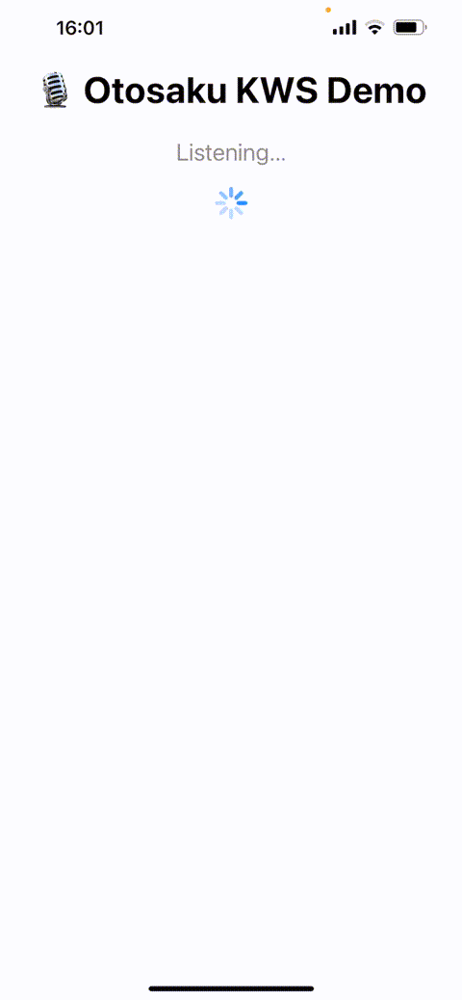

# 🧠 OtosakuKWS – On-Device Keyword Spotting (KWS) for iOS

**OtosakuKWS** is a lightweight, privacy-focused keyword spotting engine for iOS, designed to detect speech commands in real time — entirely on device.

It uses a CRNN CoreML model combined with log-Mel spectrograms for fast, accurate, and low-latency voice command recognition.

---
## 🎥 Demo

Watch the model running live on iPhone 13:



---

## 🚀 Getting Started

### 1. Install Feature Extractor

This project depends on the [OtosakuFeatureExtractor-iOS](https://github.com/Otosaku/OtosakuFeatureExtractor-iOS) Swift package, which extracts log-Mel spectrograms in real time using Accelerate.

It also includes a ready-to-use filterbank archive (`filterbank.npy`, `hann_window.npy`).

---

### 2. Download Pretrained Model

The CRNN model was trained on the keywords: **“go”, “no”, “stop”, “yes”**

[⬇️ Download model archive](https://drive.google.com/file/d/1kvSEj3-UqOdfk_22B54H3AAuuuuGUsUx/view?usp=sharing)

Includes:
- `CRNNKeywordSpotter.mlmodelc`
- `classes.txt`

---

## 🧪 Validation Metrics

| Metric              |     Value |
|:--------------------|----------:|
| val_accuracy        | 0.971313  |
| val_f1_go           | 0.964216  |
| val_f1_no           | 0.974067  |
| val_f1_other        | 0.949783  |
| val_f1_stop         | 0.983282  |
| val_f1_yes          | 0.98564   |
| val_loss            | 0.0846668 |
| val_precision_go    | 0.977573  |
| val_precision_no    | 0.966123  |
| val_precision_other | 0.949195  |
| val_precision_stop  | 0.985112  |
| val_precision_yes   | 0.979248  |
| val_recall_go       | 0.95122   |
| val_recall_no       | 0.982143  |
| val_recall_other    | 0.950372  |
| val_recall_stop     | 0.981459  |
| val_recall_yes      | 0.992116  |

> The model was trained on a balanced subset of [Google Speech Commands v2], using strong augmentations and class balancing.

---

## 🧩 Integration Example

```swift
let kws = try OtosakuKWS(
    modelRootURL: modelURL,
    featureExtractorRootURL: featurizerURL,
    configuration: .init()
)

kws.onKeywordDetected = { keyword, confidence in
    print("Detected: \(keyword) [\(confidence)]")
}

let audioInput = AudioStreamer()

// The `onBuffer` callback receives a chunk of audio sampled at 16kHz, mono (1 channel).
// `AudioStreamer` here is a dummy real-time microphone streamer that simulates live input.
audioInput.onBuffer = { buffer in
    Task {
        await kws.handleAudioBuffer(buffer)
    }
}
```

---

## 📬 Need custom commands?

If you need a custom KWS model for your use case — different keywords, languages, or domain-specific speech — feel free to reach out:

📧 **8444691@gmail.com**

---

## 🗝️ Keywords

CoreML, keyword spotting, speech commands, offline voice recognition, privacy-first AI, log-Mel spectrogram, iOS speech processing, CRNN, on-device inference, streaming audio, Swift AI
